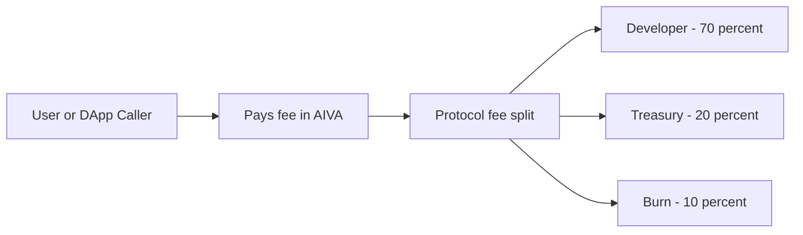

> _Monetise code, not dashboards._

## Why Build a Path?

| Benefit                         | Detail                                                                                          |
| ------------------------------- | ----------------------------------------------------------------------------------------------- |
| **Publish once → Earn forever** | 70% of every invocation fee is streamed to your wallet in real time.                            |
| **Zero-friction distribution**  | Paths are discoverable by any AIVA agent the moment they're staked.                             |
| **Composability**               | Your function can be chained with others inside multi-step NTO flows—multiplying call volume.   |
| **On-chain reputation**         | Performance history & SLA score are written to the registry; top paths trend to the front page. |
| **Governance weight**           | Staked AIVA not only secures the path—it gives you a louder voice in protocol upgrades.         |

## Dev Lifecycle

1. **Draft** a _manifest_ (YAML / JSON) that declares inputs, outputs, gas limits, and rate caps.
2. **Register** the manifest on-chain → obtain a _Path ID_.
3. **Stake** AIVA to guarantee uptime _(minimum 1 000 AIVA; slashable)_.
4. **Deploy** your endpoint (REST, GraphQL, or Lambda-style).
5. **Earn**: 70% of fee → you, 20% → treasury, 10% → burn.
6. **Upgrade / Deprecate** via governance vote proportional to staked weight.



## Path Anatomy

```json
{
  "name": "dexPrice",
  "version": "1.0.0",
  "author": "0xMerlin",
  "endpoint": "https://api.mypath.io/price",
  "method": "GET",
  "inputs": ["tokenIn", "tokenOut"],
  "outputs": ["price"],
  "rateLimit": "60 req/min",
  "sla": "99.5%"
}
```

<Note>
  Minimal, human-readable, chain-verifiable.
</Note>

## Sample Paths

```json
// 1. Live DEX price oracle
{"name":"dexPrice","in":["tokenIn","tokenOut"],"out":["price"]}

// 2. ETH gas ticker
{"name":"gasNow","in":[],"out":["gwei"]}

// 3. NFT collection floors
{"name":"nftFloor","in":["slug"],"out":["floorETH","volume"]}
```

<Tip>
  Think Lego.\
  Build tiny, single-responsibility paths; let AIVA's NTO compose them into larger automations.
</Tip>

## Security & SLA

| Risk           | Mitigation                                                                     |
| -------------- | ------------------------------------------------------------------------------ |
| Downtime       | **Slash** 1–10% stake per missed SLA window.                                   |
| Malicious data | Crowd-vote & zero-knowledge attesters flag bad outputs ➜ automatic quarantine. |
| Key leakage    | Sign all responses with on-chain verified ECDSA keys.                          |

## Quick-Start Checklist

- Fork the _path-template_ repo
- Write the handler (≤ 200 LOC recommended)
- Unit-test with aiva-path-sim CLI
- Submit manifest to `MCPRegistry.register()`
- Stake AIVA & monitor PathHealth dashboard

## Road to Mainnet

| Phase            | Target                                                               |
| ---------------- | -------------------------------------------------------------------- |
| **Alpha** (live) | Manual curation, 25 whitelisted paths, 5 TPS cap                     |
| **Beta Q3 2025** | Permissionless registry, fee markets, path mirrors on L2             |
| **Mainnet 2026** | Cross-domain routing, zk-attested outputs, hierarchical reward pools |

**Build once, earn on every click the interface renders.**\
Join the MCP and turn your Lambda, API, or script into a perpetual revenue stream inside the AIVA execution economy.