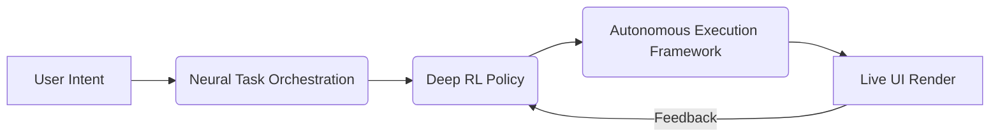

## High‑Level Pipeline

[Read the full technical white‑paper ➜](https://aivai.xyz/whitepaper)

- **NTO** parses intent and decomposes multi‑step workflows.
- **DRL Policy** ranks interface layouts and execution paths.
- **AEF** executes on Web2 APIs, smart‑contracts, or MCP paths.
- **Renderer** streams HTML / WebGL back in \< 300 ms.

## Model‑Context‑Protocol (MCP)

Think of MCP as an “open API market” that AIVA agents discover at runtime. Developers publish **Paths** (deterministic functions) with on‑chain staking. AIVA selects, verifies, and composes these Paths on demand.