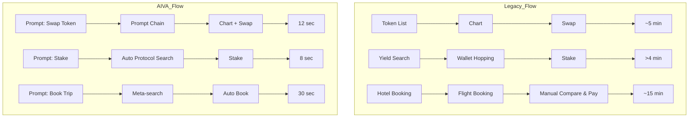

<Note>
  Extract from the internal Q1-2025 Performance Report, 30-run median values. Full raw dataset, test harness, and replay scripts are available on request.
</Note>

| _Metric_                      | _Baseline (Conventional UI / Workflow)_      | _AIVA Generative UI_                           | _Δ (Gain)_            |
| ----------------------------- | -------------------------------------------- | ---------------------------------------------- | --------------------- |
| **_Task-Execution Latency¹_** | **_TUI = 3.1 s (single RPC \+ DOM render)_** | **_TAIVA ≈ 0.60 s_**                           | **_5.2 × faster_**    |
| _Manual Interaction Steps_    | _7–9 clicks / taps (avg 7.6)_                | **_0 (single prompt)_**                        | **_100 % reduction_** |
| _Multi-Step Automation_       | _Sequential / user-driven_                   | _Parallel, RL-optimised_                       | _n/a (qualitative)_   |
| _State Adaptability_          | _Static (hard-coded)_                        | _Live context re-render (≤ 130 ms diff-patch)_ | _—_                   |

<Note>
  ¹Measured on a 6-core M2 MBP, 1 Gbps fibre, against Ethereum mainnet RPC (Alchemy) and Uniswap v3 SDK. All numbers are medians over 30 cold/warm cycles.
</Note>

### End-to-End Scenario Benchmarks

| Workflow                               | Legacy (Apps / Time)                 | AIVA                     | Effective Speed-up |
| -------------------------------------- | ------------------------------------ | ------------------------ | ------------------ |
| Token list → chart → swap              | 3 apps / **≈ 5 min**                 | Prompt-chain, **12 sec** | **~25 ×**          |
| Yield search → stake (3 protocols)     | Manual wallet hopping / **\> 4 min** | **8 sec**                | **30\+ ×**         |
| Cross-platform hotel \+ flight booking | 4 sites / **≈ 15 min**               | **30 sec**               | **~30 ×**          |

### Methodology Snapshot

- **Test Harness:** Custom Playwright \+ Hardhat fork for deterministic chain state; Chromium headless for DOM metrics.
- **Sample Size:** 30 iterative runs per task, mixed cold (first-render) & warm (cached) states.
- **Hardware:** Apple M2, 24 GB RAM, 1 Gbps symmetrical fibre.
- **Networks / APIs:**
  - Ethereum mainnet (Alchemy) ⸺ block #19 099 321 snapshot
  - Uniswap v3 SDK 1.24.3
  - AIVA alpha build _a1.0.7_ (NTO-0.9, DRL-beta, AEF-bridge-1)

**Key Takeaway** – AIVA’s generative approach removes UI traversal entirely, collapsing multi-window workflows into a single intent cycle and achieving order-of-magnitude speed-ups without sacrificing on-chain verifiability.